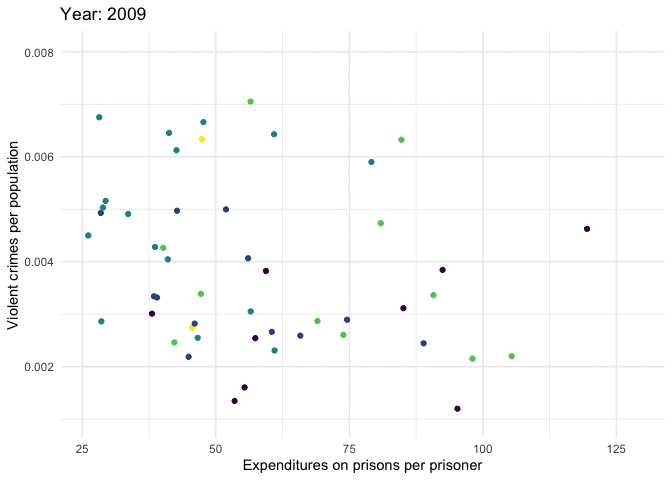

<style>
  .column {
  float: left;
  width: 33%;
  }
  .row:after {
  content: "";
  display: table;
  clear: both;
  }
  .col2 {
    columns: 2 200px;         /* number of columns and width in pixels*/
    -webkit-columns: 2 200px; /* chrome, safari */
    -moz-columns: 2 200px;    /* firefox */
  }
</style>

```{r setup, include=FALSE}
knitr::opts_chunk$set(echo = FALSE)
```

```{r, echo=FALSE, warning=FALSE, message=FALSE}
library(readr)
library(dplyr)
library(grid)
library(gridExtra)
library(ggplot2)
library(plotly)
library(panelr)
library(knitr)
library(spData)
library(sf)
library(tmap)
library(kableExtra)
library(formattable)
library(factoextra)
library(heatmaply)
library(gganimate)
library(ggrepel)
library(gghighlight)
library(viridis)
library(reshape2)

kable_f = function(...) {
  knitr::kable(..., format.args = list(decimal.mark = '.', big.mark = ",")) %>% 
    kable_styling(bootstrap_options = c("hover", "condensed", "responsive"), full_width = F)
}

# extract legend
# https://github.com/hadley/ggplot2/wiki/Share-a-legend-between-two-ggplot2-graphs
g_legend<-function(a.gplot){
  tmp <- ggplot_gtable(ggplot_build(a.gplot))
  leg <- which(sapply(tmp$grobs, function(x) x$name) == "guide-box")
  legend <- tmp$grobs[[leg]]
  return(legend)}

ucr <- read_csv("data/ucr_by_state.csv")
ucr$year <- as.factor(ucr$year)

ucr <- ucr[, -c(16:21)]
# removing all missing rows
ind <- apply(ucr, 1, function(x) all(is.na(x)))
ucr <- ucr[ !ind, ]

ucr$jurisdiction[ucr$jurisdiction=="DC"] <- "District of Columbia"
ucr <- ucr %>% filter(jurisdiction!="Puerto Rico")

ucr$rape_legacy <- NULL
ucr$rape_revised <- NULL

prison <- read_csv("data/prison_custody_by_state.csv")

colnames(prison)[3:18] <- paste0(colnames(prison)[3:18],'1')
prison <- long_panel(prison, begin = 2001, end = 2016, label_location = "beginning", id = "jurisdiction")
names(prison)[names(prison) == "wave"] <- "year"
names(prison)[names(prison) == "1"] <- "prison"
prison$year <- as.factor(prison$year)

prison_exp <- read_delim("data/prison_expenditures.csv", ";")

prison_exp <- long_panel(prison_exp, begin = 2009, end = 2016, prefix="_", label_location = "end", id = "jurisdiction")
names(prison_exp)[names(prison_exp) == "wave"] <- "year"
prison_exp$year <- as.factor(prison_exp$year)
prison_exp$jurisdiction <- NULL
colnames(prison_exp)[2] <- "jurisdiction"

us_states_info <- data.frame(jurisdiction = us_states$NAME, 
                             region = us_states$REGION,
                             area_km2 = as.numeric(round(us_states$AREA, 0)))

additional_states <- data.frame(jurisdiction = c("Hawaii", "Alaska"),
           region = c("remote", "remote"),
           area_km2 = c(16638, 1481346))

us_states_info <- rbind(us_states_info, additional_states)
```

## Aim of the project

<br>
<br>
Review of crime and incarceration trends in the United States and also examining the relationships in data regarding crimes commited, number of prisoners and prison expenditures across time and states.


## Data 

- The FBI Uniform Crime Reporting Program (UCR dataset)
- The National Prisoner Statistics Program (prison dataset)
- Justice Expenditure And Employment Extracts Series (prison expenditures dataset)


## Specificity of District of Columbia

```{r warning=FALSE, message=FALSE, fig.height=5, fig.align='center'}
bar.theme = theme(axis.text.x = element_blank(),
                axis.title.x = element_blank(),
                legend.position = "bottom",
                panel.grid.major = element_blank(), 
                panel.grid.minor = element_blank())

plot.data <- left_join(ucr, us_states_info, by="jurisdiction") %>% 
                      group_by(jurisdiction) %>% 
                      summarise(property_crime_total = mean(property_crime_total),
                                violent_crime_total = mean(violent_crime_total),
                                area_km2 = mean(area_km2),
                                state_population = mean(state_population))

plot.data$highlight <- ifelse(plot.data$jurisdiction=="District of Columbia", 1, 0)
plot.data <- plot.data %>% mutate(property_per_area = property_crime_total/area_km2,
                                  property_per_pop = property_crime_total/state_population,
                                  violent_per_area = violent_crime_total/area_km2,
                                  violent_per_pop = violent_crime_total/state_population)

ggp1 <- ggplot() + 
          geom_bar(data=plot.data, aes(x = reorder(jurisdiction, -property_crime_total), 
                                       y = property_crime_total, 
                                       fill = as.factor(highlight)), stat="identity") + 
          scale_fill_viridis_d(name="Jurisdiction", labels = c("other", "District of Columbia"),
                              begin = 0.3, end = 0.8) +
          theme_minimal() +
          labs(y = "Property crimes total") +
          bar.theme

ggp2 <- ggplot() + 
          geom_bar(data=plot.data, aes(x = reorder(jurisdiction, -property_per_area), 
                                       y = property_per_area, 
                                       fill = as.factor(highlight)), stat="identity") + 
          scale_fill_viridis_d(name="Jurisdiction", labels = c("other", "District of Columbia"),
                              begin = 0.3, end = 0.8) +
          theme_minimal() +
          labs(y = "Property crimes (per area)")  +
          bar.theme

ggp3 <- ggplot() + 
          geom_bar(data=plot.data, aes(x = reorder(jurisdiction, -property_per_pop), 
                                       y = property_per_pop, 
                                       fill = as.factor(highlight)), stat="identity") + 
          scale_fill_viridis_d(name="Jurisdiction", labels = c("other", "District of Columbia"),
                              begin = 0.3, end=0.8) +
          theme_minimal() +
          labs(y = "Property crimes (per population)")  +
          bar.theme

ggp4 <- ggplot() +
          geom_bar(data=plot.data, aes(x = reorder(jurisdiction, -violent_crime_total),
                                       y = violent_crime_total,
                                       fill = as.factor(highlight)), stat="identity") +
          scale_fill_viridis_d(name="Jurisdiction", labels = c("other", "District of Columbia"),
                              begin = 0.3, end=0.8) +
          theme_minimal() +
          labs(y = "Violent crimes total") +
                  bar.theme

ggp5 <- ggplot() +
          geom_bar(data=plot.data, aes(x = reorder(jurisdiction, -violent_per_area),
                                       y = violent_per_area,
                                       fill = as.factor(highlight)), stat="identity") +
          scale_fill_viridis_d(name="Jurisdiction", labels = c("other", "District of Columbia"),
                              begin = 0.3, end=0.8) +
          theme_minimal() +
          labs(y = "Violent crimes (per area)")  +
          bar.theme

ggp6 <- ggplot() +
        geom_bar(data=plot.data, aes(x = reorder(jurisdiction, -violent_per_pop),
                                     y = violent_per_pop,
                                     fill = as.factor(highlight)), stat="identity") +
        scale_fill_viridis_d(name="Jurisdiction", labels = c("other", "District of Columbia"),
                            begin = 0.3, end=0.8) +
        theme_minimal() +
        labs(y = "Violent crimes (per population)")  +
                bar.theme

mylegend <- g_legend(ggp1)

grid.arrange(arrangeGrob(ggp1 + theme(legend.position="none"),
                         ggp2 + theme(legend.position="none"),
                         ggp3 + theme(legend.position="none"),
                         ggp4 + theme(legend.position="none"),
                         ggp5 + theme(legend.position="none"),
                         ggp6 + theme(legend.position="none"),
                         nrow=2), mylegend, nrow=2, heights=c(10, 1))
```

```{r, include=FALSE}
ucr <- ucr %>% filter(jurisdiction!="District of Columbia")
prison_exp <- prison_exp %>% filter(jurisdiction!="District of Columbia")
```

## Background (1/3){.flexbox .vcenter}

```{r, warning=FALSE, fig.height=4, fig.align='center'}
prison_year <- prison %>% group_by(year) %>% summarise(value = sum(prison))

p <- ggplot(data = prison_year, aes(x = year, y = value/1000000, color = year,  
                                    text = paste("Year: ", year, "<br>Number of prisoners:", 
                                                 comma(round(value), 0)))) +
        geom_point() +
        scale_color_viridis_d() +
        labs(title = "Number of prisoners in state and federal prison in the USA per year", 
             x = "Year", 
             y = "Number of prisoners (in milions)") +
        theme_minimal() +
        theme(legend.position = "none")
  
ggplotly(p, tooltip = "text")
```

## Background (2/3){.flexbox .vcenter}

```{r warning=FALSE, message=FALSE}
#create df with mean values across years per state from ucr
ucr_grouped <- ucr %>% 
                  group_by(jurisdiction) %>% 
                  summarise(violent_crime_total = mean(violent_crime_total),
                            property_crime_total = mean(property_crime_total))
#rename variable for merging
names(ucr_grouped)[names(ucr_grouped) == "jurisdiction"] <- "NAME"
#merge grouped ucr and state spatial data
us_states_ucr <- merge(us_states, ucr_grouped, by = "NAME")

#create values per population
us_states_ucr$violent_crime_per_pop <- us_states_ucr$violent_crime_total/us_states_ucr$total_pop_15
us_states_ucr$property_crime_per_pop <- us_states_ucr$property_crime_total/us_states_ucr$total_pop_15

us_states_midwest <- us_states %>% 
                        filter(REGION=="Midwest") %>% 
                        st_union() %>% 
                        cbind(data.frame(REGION="Midwest")) %>% 
                        st_sf()
us_states_norteast <- us_states %>% 
                        filter(REGION=="Norteast") %>% 
                        st_union() %>% 
                        cbind(data.frame(REGION="Norteast")) %>% 
                        st_sf()
us_states_south <- us_states %>% 
                        filter(REGION=="South") %>% 
                        st_union() %>% 
                        cbind(data.frame(REGION="South")) %>% 
                        st_sf()
us_states_west <- us_states %>% 
                        filter(REGION=="West") %>% 
                        st_union() %>% 
                        cbind(data.frame(REGION="West")) %>% 
                        st_sf()
us_states_regions <- rbind(us_states_midwest, us_states_norteast, us_states_south, us_states_west) %>% st_sf()

# create usa map for both crime types
usa1 <- ggplot(data = us_states_ucr) +
          geom_sf(aes(fill = property_crime_per_pop), lwd = 0, color = "white") +
          scale_fill_viridis_c(option = "viridis", trans = "sqrt", name = "Property crimes\nper population") +
          theme(legend.position = "none") +
          theme_minimal()
usa2 <- ggplot(data = us_states_ucr) +
          geom_sf(aes(fill = violent_crime_per_pop), lwd = 0, color = "white") +
          scale_fill_viridis_c(option = "viridis", trans = "sqrt", name = "Violent crimes\nper population") +
          theme(legend.position = "none") +
          theme_minimal()

# format main map
usa_all1 <- usa1 + 
              ggtitle("Property crimes per population across states")+
              theme(legend.position = "right") +
              geom_sf(data = us_states_regions, aes(color=REGION), alpha=0, size = 0.8) +
              scale_color_manual(values = heat.colors(6)[2:5], name = "Region")

usa_all2 <- usa2 + 
              ggtitle("Violent crimes per population across states") +
              theme(legend.position = "right") +
              geom_sf(data = us_states_regions, aes(color=REGION), alpha=0, size = 0.8) +
              scale_color_manual(values = heat.colors(6)[2:5], name = "Region")

# zoom and format zoomed map of DC
usa_dc1 <- usa1 + 
            coord_sf(xlim = c(-79, -75), ylim = c(38, 40)) +
            guides(fill=FALSE) +
            theme(axis.title = element_blank(), 
                  axis.text  = element_blank(),
                  axis.ticks = element_blank(),
                  legend.position = "none")
usa_dc2 <- usa2 + 
            coord_sf(xlim = c(-79, -75), ylim = c(38, 40)) +
            guides(fill=FALSE) +
            theme(axis.title = element_blank(), 
                  axis.text  = element_blank(),
                  axis.ticks = element_blank(),
                  legend.position = "none") 

# combine both plots and add rectangle around zoomed area
ggp1 <- usa_all1 + 
          annotation_custom(ggplotGrob(usa_dc1), xmin= -80, ymax= 35)+
          geom_rect(aes(xmin = -79, xmax= -75, ymin=38, ymax = 40), size=0.6, fill=NA, color="black") +
          guides(fill = guide_legend(order = 1), color = guide_legend(order = 2))

ggp2 <- usa_all2 + 
          annotation_custom(ggplotGrob(usa_dc2), xmin= -80, ymax= 35)+
          geom_rect(aes(xmin = -79, xmax= -75, ymin=38, ymax = 40), size=0.6, fill=NA, color="black") +
          guides(fill = guide_legend(order = 1), color = guide_legend(order = 2))
```

```{r}
ggp1
```

## Background (3/3){.flexbox .vcenter}

```{r}
ggp2
```

## Incarceration and crime rates (1/4){.flexbox .vcenter}

<div class="columns-2">
Violent crimes per population in time
{width=350px}

Property crimes per population in time
{width=350px}

</div>

## Incarceration and crime rates (2/4){.flexbox .vcenter} 

```{r warning=FALSE, message=FALSE, fig.height=7}
# preparing data
prison_data <- prison %>% filter(year==2001 | year==2016) %>% 
  select(jurisdiction, year, prison)

data_prep <- left_join(ucr, us_states_info, by = "jurisdiction")
data_prep1 <- left_join(data_prep, prison_data, by = c("jurisdiction", "year"))


v1 <- data_prep1 %>% 
  filter(year==2001) %>% 
  mutate(violent_crime_total_rate_2001 = violent_crime_total/state_population,
         property_crime_total_rate_2001 = property_crime_total/state_population,
         imprisonment_rate_2001 = prison/state_population) %>% 
  select(jurisdiction, 
         violent_crime_total_rate_2001, 
         property_crime_total_rate_2001, 
         imprisonment_rate_2001)  

v2 <- data_prep1 %>% 
  filter(year==2016) %>% 
  mutate(violent_crime_total_rate_2016 = violent_crime_total/state_population,
         property_crime_total_rate_2016 = property_crime_total/state_population,
         imprisonment_rate_2016 = prison/state_population) %>% 
  select(jurisdiction, 
         violent_crime_total_rate_2016, 
         property_crime_total_rate_2016,
         imprisonment_rate_2016)

final_data <- left_join(v1, v2, by = "jurisdiction")

# percentage change
final_data_plot <- final_data %>% 
  mutate(
    pct_change_violent = (violent_crime_total_rate_2016-violent_crime_total_rate_2001)/(violent_crime_total_rate_2001)*100,
    pct_change_property = (property_crime_total_rate_2016-property_crime_total_rate_2001)/(property_crime_total_rate_2001)*100,
    pct_change_imprisonment = (imprisonment_rate_2016-imprisonment_rate_2001)/(imprisonment_rate_2001)*100) %>%
  select(jurisdiction, pct_change_violent, pct_change_property, pct_change_imprisonment)

ggp_violent <- ggplot(data = final_data_plot, 
                      aes(x = reorder(jurisdiction, -pct_change_violent), 
                          y = pct_change_violent, 
                          fill = as.factor(pct_change_violent), 
                          text = paste0("Jurisdiction: ", jurisdiction,
                                       "<br>Percentage change: ", round(pct_change_violent, 2), '%'))) +
  geom_bar(stat='identity', position="dodge") +
  scale_y_continuous(limits=c(-50, 220), breaks=seq(-50, 220, 50), labels=percent) +
  coord_flip() +
  labs(title = "Percent change in state violent crime rates, 2001-2016", 
       x = "Jurisdiction", 
       y = "Percentage change") +
  scale_fill_viridis_d() +
  theme_minimal() +
  theme(legend.position = "none", axis.text=element_text(size=6)) 


ggp_property <- ggplot(data = final_data_plot,
                       aes(x = reorder(jurisdiction, pct_change_property),
                           y = pct_change_property,
                           fill = as.factor(pct_change_property),
                           text = paste0("Jurisdiction: ", jurisdiction,
                                       "<br>Percentage change: ", round(pct_change_property, 2), '%'))) +
  geom_bar(stat='identity') +
  scale_y_continuous(limits=c(-50, 10), breaks=seq(-50, 10, 10), labels=percent) +
  coord_flip() +
  labs(title = "Percent change in state property crime rates, 2001-2016",
       x = "Jurisdiction",
       y = "Percentage change") +
  scale_fill_viridis_d() +
  theme_minimal() +
  theme(legend.position = "none", axis.text=element_text(size=6))

ggp_imprisonment <- ggplot(data = final_data_plot,
                       aes(x = reorder(jurisdiction, -pct_change_imprisonment),
                           y = pct_change_imprisonment,
                           fill = as.factor(pct_change_imprisonment),
                           text = paste0("Jurisdiction: ", jurisdiction,
                                       "<br>Percentage change: ", round(pct_change_imprisonment, 2), '%'))) +
  geom_bar(stat='identity') +
  coord_flip() +
  labs(title = "Percent change in state imprisonment rates, 2001-2016",
       x = "Jurisdiction",
       y = "Percentage change") +
  scale_fill_viridis_d() +
  theme_minimal() +
  scale_y_continuous(limits=c(-40, 80), breaks=seq(-40, 80, 10), labels=percent) +
  theme(legend.position = "none", axis.text=element_text(size=6))
```

```{r warning=FALSE, message=FALSE, fig.height=5, fig.align='center'}
ggplotly(ggp_violent, tooltip = "text")
```

## Incarceration and crime rates (3/4){.flexbox .vcenter}

```{r warning=FALSE, message=FALSE, fig.height=5, fig.align='center'}
ggplotly(ggp_property, tooltip = "text") 
```

## Incarceration and crime rates (4/4){.flexbox .vcenter} 

```{r warning=FALSE, message=FALSE, fig.height=5, fig.align='center'}
ggplotly(ggp_imprisonment, tooltip = "text") 
```

## Investments into prisons and crime rates{.flexbox .vcenter}





## Clustering (1/3){.flexbox .vcenter}

```{r warning=FALSE, message=FALSE}
data_to_cluster <- ucr %>% dplyr::select(-c(crime_reporting_change, crimes_estimated, violent_crime_total, property_crime_total))

data_to_cluster <- data_to_cluster %>% 
  group_by(jurisdiction) %>% 
  mutate(murder_manslaughter_per_pop = mean(murder_manslaughter/state_population),
         robbery_per_pop = mean(robbery/state_population),
         agg_assault_per_pop = mean(agg_assault/state_population),
         burglary_per_pop = mean(burglary/state_population), 
         larceny_per_pop = mean(larceny/state_population),
         vehicle_theft_per_pop = mean(vehicle_theft/state_population)) 

data_to_cluster <- data_to_cluster %>% select(-c(year, state_population, murder_manslaughter, robbery, agg_assault, burglary, larceny, vehicle_theft)) %>% distinct()

rownames(data_to_cluster) <- data_to_cluster$jurisdiction
data_to_cluster$jurisdiction <- NULL

data_to_cluster <- scale(data_to_cluster)
```

```{r warning=FALSE, message=FALSE, fig.height=5, fig.align='center'}
distance <- get_dist(data_to_cluster)
distance <- as.matrix(distance)
heatmaply(distance,  
          cellnote_size = 8, fontsize_row = 6, fontsize_col = 7,
          Rowv = FALSE, Colv = FALSE,
          main = 'Dissimilarity matrix for all states')
```

## Clustering (2/3)

```{r fig.height=5, warning=FALSE, message=FALSE, fig.align='center'}
res.hc <- eclust(data_to_cluster, k=3, "hclust") 
fviz_dend(res.hc, 
          rect = TRUE, 
          k_colors = viridis(3),
          rect_border = viridis(8)[5],
          main = "Clustering of states based on number of different kinds of crimes (3 clusters)",
          cex = 0.7,
          ggtheme = theme_minimal()) 
```

## Clustering (3/3)

```{r warning=FALSE, message=FALSE}
clusters <- data.frame(jurisdiction = rownames(data_to_cluster),
                       cluster = res.hc$cluster)
rownames(clusters) <- NULL

clusters <- clusters %>% 
  left_join(us_states_info, by = "jurisdiction") %>% 
  dplyr::select(jurisdiction, cluster, region)

table <- table(clusters$region, clusters$cluster)
colnames(table) <- c("Cluster 1", "Cluster 2", "Cluster 3")
kable_f(table)
```


```{r, fig.align='center', fig.height=3}
# merge cluster data and state spatial data
colnames(clusters)[1] <- "NAME"
us_states_clusters <- merge(us_states, clusters, by = "NAME")

usa1 <- ggplot() +
  geom_sf(data = us_states_clusters, aes(fill = as.factor(cluster)), lwd = 0, color="white") +
  scale_fill_manual(values = viridis(6)[2:5], name = "Cluster") +
  theme(legend.position = "none") +
  theme_minimal() +
  ggtitle("Mapping clusters and regions") +
  theme(legend.position = "right") +
  geom_sf(data = us_states_regions, aes(color=REGION), alpha=0, size = 0.8) +
  scale_color_manual(values = heat.colors(6)[2:5], name = "Region") +
  guides(fill = guide_legend(order = 1), color = guide_legend(order = 2))

usa1
```

## Conclusions

- There are on average 10 times more property crimes than violent crimes per square km.
- Northeastern region has the highest number of crimes. 
- Midwestern states like New York, Pennsylvania, New Jersey and Massachusets are ranked higher with violent crimes than property crimes. 
- There is a positive relationship between the number of prisoners per capita and the rates of violent crimes per capita. Over time, the relationship is ambiguous.
- For both violent and property crimes the numbers drop after 2009. 
- North and South Dakotas showed the highest percentage change in crimes between 2001 and 2016.
- The state with the highest percentage change of incarceration rates is West Virginia. 
- We couldn't define the relationship between investments into prisons and crime rates. 
- Clustering into 3 clusters matched geographical locations of the states.

