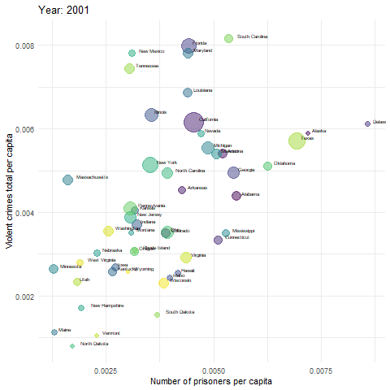
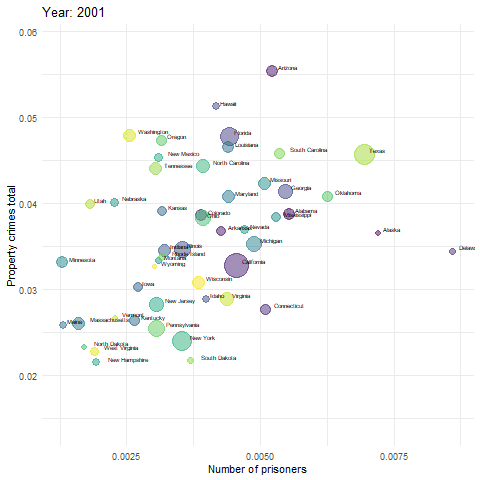

  
```{r, echo=FALSE, warning=FALSE, message=FALSE}
library(readr)
library(dplyr)
library(gridExtra)
library(ggplot2)
library(plotly)
library(panelr)
library(knitr)
library(spData)
library(sf)
library(tmap)
library(kableExtra)
library(formattable)
library(factoextra)
library(heatmaply)
library(gganimate)
library(ggrepel)
library(gghighlight)

kable_f = function(...) {
  knitr::kable(..., format.args = list(decimal.mark = '.', big.mark = ",")) %>% 
    kable_styling(bootstrap_options = c("hover", "condensed", "responsive"), full_width = F)
}

# extract legend
# https://github.com/hadley/ggplot2/wiki/Share-a-legend-between-two-ggplot2-graphs
g_legend<-function(a.gplot){
  tmp <- ggplot_gtable(ggplot_build(a.gplot))
  leg <- which(sapply(tmp$grobs, function(x) x$name) == "guide-box")
  legend <- tmp$grobs[[leg]]
  return(legend)}
```

<style>
  body {
  text-align: justify;
  }
  .column {
  float: left;
  width: 33%;
  }
  .row:after {
  content: "";
  display: table;
  clear: both;
  }
  .col2 {
    columns: 2 200px;         /* number of columns and width in pixels*/
    -webkit-columns: 2 200px; /* chrome, safari */
    -moz-columns: 2 200px;    /* firefox */
  }
  .col3 {
    columns: 3 100px;
    -webkit-columns: 3 100px;
    -moz-columns: 3 100px;
  }
  h1 { /* Header 1 */
    font-size: 24px;
  }
  h2 { /* Header 2 */
      font-size: 20px;
  }
  h3 { /* Header 3 */
    font-size: 16px;
  }
  h4 { /* Header 4 */
    font-size: 14px;
  }
</style>

# Introduction

The main objective of this paper is to review general crime and incarceration trends in the United States and also examine the relationships in data regarding crimes commited, number of prisoners and prison expenditures across time and states. We enrich the report with visualisations that help to detect important insights. Besides statistical analysis, we also take a stab at clustering state regions in order to define groups that follow similar tendency in crime.

# Data description and preprocessing

The datasets used in the below analysis were sourced from www.kaggle.com website [^kaggle]. They were created based on several sources including the Bureau of Justice Statistics [^bjs] and FBI Uniform Crime Reporting Program [^fbi]. The National Prisoner Statistics Program conducted by the Bureau of Justice Statistics has collected data on the number of prisoners in state and federal prison facilities since 1926. It is produced annually on national and state level. Data are sourced from 50 state departments of correction, the Federal Bureau of Prisons, and until 2001, from the District of Columbia. The UCR Program provides statistics on violent and property crimes. Data are collected annually and are available on national, state and city level. For the purposes of our analysis we are using state-level statistics.

Additionally, we individually collected data on federal expenditures (direct expenditures; corrections) for correctional institutions provided by the Bureau of Justice Statistics for each state between 2009 and 2016 [^prison_exp]. Later in the analysis we will use them in order to correlate the expenditures with the occurence of particular crimes. Apart from the number of total incarcerated prisoners we also collected information on the number of prisoners in private prisons across several states for the same years as prison expenditures [^prisoners].

## UCR 

The UCR dataset consist of 15 variables, two of which are the jurisdiction and year of the observation. It provides information about the state population and also about number of violent crimes (murder, manslaughter, rape, robbery, aggravated assault) and property crimes (burglary, larceny, vehicle theft) per state yearly. Detailed definitions of each crimes can be found on UCR Program website.

The *crime_reporting_change* variable reflects instances when states' reporting standards changed. The *crimes_estimated* variable indicates cases where the FBI computes estimates for participating agencies not providing 12 months of complete data for state [^estimated_crime].

```{r, message=FALSE, warning=FALSE}
ucr <- read_csv("data/ucr_by_state.csv")
ucr$year <- as.factor(ucr$year)
```

Below are listed all column names from UCR dataset.

```{r, message=FALSE, warning=FALSE}
colnames(ucr)
```

The UCR dataset has a lot of missing values, compared to the other datasets that have none. We dropped the last 6 columns that were completely empty and then we dropped rows consisting of only missing values. It leaves all columns without any missing values apart from "rape_revised" with 612 missing values and "rape_legacy" with 104 missing values.

```{r}
# removing last 6 columns
ucr <- ucr[, -c(16:21)]
# removing all missing rows
ind <- apply(ucr, 1, function(x) all(is.na(x)))
ucr <- ucr[ !ind, ]
# showing sum of missing values per columns
sapply(ucr, function(x) sum(is.na(x)))
```

As you can see on plot on the left below, in the last two years, 2016 and 2017, there is an additional obervation ie. jurisdiction. Looking at the plot on the right, New York is missing in one year, Puerto Rico is visible in only 3 years. District of Columbia is sometimes renamed as DC, but overall it sums up to all 17 years.

```{r, fig.width = 7, fig.height=3, message=FALSE, warning=FALSE, fig.align='center'}
library(viridis)
plot.data1 = ucr %>% group_by(year) %>% count()
ggp1 = ggplot(data = plot.data1, aes(x=year, y=n, fill=year,
                                     text = paste("Year: ", year, 
                                                  "<br>Number of observations:", n))) + 
  geom_bar(stat = "identity") +
  scale_fill_viridis_d() +
  scale_x_discrete(breaks = as.factor(seq(2001, 2017,2))) +
  theme_minimal() + 
  theme(axis.title.x = element_blank(), 
        axis.title.y = element_blank(),
        legend.position = "none")

plot.data2 = ucr %>% group_by(jurisdiction) %>% count() %>% arrange(n) %>% filter(n<17)
ggp2 = ggplot(data = plot.data2, aes(x=jurisdiction, y=n, fill=jurisdiction,
                                     text = paste("Jurisdicion:", jurisdiction, 
                                                  "<br>Number of observations: ", n))) + 
  geom_bar(stat = "identity") +
  theme_minimal() + 
  scale_fill_viridis_d() +
  theme(axis.title.x = element_blank(), 
        axis.title.y = element_blank(),
        legend.position = "none")

ggp1 <- ggplotly(ggp1, tooltip = "text")
ggp2 <- ggplotly(ggp2, tooltip = "text")

subplot(ggp1, ggp2, nrows = 1)
```

Based on the above analysis, we decided to rename "DC" to "District of Columbia" and exclude Puerto Rico state.

```{r}
ucr$jurisdiction[ucr$jurisdiction=="DC"] <- "District of Columbia"
ucr <- ucr %>% filter(jurisdiction!="Puerto Rico")
```

We also analysed the missing values of variables *rape_revised* and *rape_legacy*. Because there are so many missings and they mostly do not occur in the same year, we can't compare them and that's why we decided to drop them. The comparison of number of observations for both variables can be seen in the table below.

```{r}
rape_df <- data.frame(year=as.factor(2001:2017))

rape_revised_count <- ucr[!is.na(ucr$rape_revised),] %>% 
                            group_by(year) %>% 
                            count(name="rape_revised_count")
rape_legacy_count <- ucr[!is.na(ucr$rape_legacy),] %>% 
                            group_by(year) %>% 
                            count(name="rape_legacy_count")
rape_df <- left_join(rape_df, rape_revised_count, by="year")
rape_df <- left_join(rape_df, rape_legacy_count, by="year")
```
### {.tabset .tabset-fade .tabset-pills}
#### Hide data

#### Show data
```{r}
kable_f(rape_df)
```
### <span style="color: white; font-size:8px;">.</span>
```{r, message=FALSE, warning=FALSE}
ucr$rape_legacy <- NULL
ucr$rape_revised <- NULL
```

These are the final columns that are in the UCR dataset.

```{r}
colnames(ucr)
```

On the plots below are presented distributions of number of different types of crimes. They are mainly concentrated near 0. There are however a few spikes visible especially in case of robbery, burglary and larceny indicating outliers. In case of larceny, we can also observe that it has two peaks that we can attribute to multiple modes.

```{r, fig.width = 9, fig.asp = 1.1, message=FALSE, warning=FALSE, fig.align='center'}
pl <- vector("list", length = ncol(ucr[,c(5:13)])-1)
colors <- viridis(8)
for(ii in seq_along(pl)) {
  .col <- colnames(ucr[,c(5:13)])[-1][ii]
  .p <- ggplot(ucr, aes_string(x=.col, fill="colors[ii]", color="colors[ii]")) + 
          geom_density(alpha=0.3) + 
          scale_fill_manual(values = colors[ii], aesthetics = c("color", "fill")) +
          theme_minimal() +           
          theme(legend.position = "none",
                axis.title.x = element_blank(),
                axis.title.y = element_blank()) +
          labs(title = .col) + 
          scale_y_continuous(labels = function(x) format(x, scientific = FALSE)) + 
          scale_x_continuous(labels = function(x) format(x, scientific = FALSE)) 
  
  pl[[ii]] <- .p
}

grid.arrange(grobs=pl, ncol=2)
```

## Incarcarations in prison

The prison data, compared to ucr is in a panel form, consisting of years as columns from 2001 to 2016. Using long_panel, we converted the dataframe so that each row is a different jurisdiction and year. The dataset includes also information indicating whether the number of prisoners also includes jails population.

```{r message=FALSE, warning=FALSE}
prison <- read_csv("data/prison_custody_by_state.csv")

colnames(prison)[3:18] <- paste0(colnames(prison)[3:18],'1')
prison <- long_panel(prison, begin = 2001, end = 2016, label_location = "beginning", id = "jurisdiction")
names(prison)[names(prison) == "wave"] <- "year"
names(prison)[names(prison) == "1"] <- "prison"
prison$year <- as.factor(prison$year)

kable_f(head(prison))
```

## Number of prisoners in private prisons

Similarly to prison data, private_prisons are also presented in a panel form and are transformed using long_panel. Additionally, we created a column showing a percentage of private prisoners among all incarcerated.

```{r, warning=FALSE, message=FALSE}
private_prisons <- read_delim("data/private_prisons.csv", ";", na="/")

colnames(private_prisons)[2:9] <- paste0(colnames(private_prisons)[2:9],'1')
private_prisons <- long_panel(private_prisons, begin = 2009, end = 2016, label_location = "beginning", id = "jurisdiction")
names(private_prisons)[names(private_prisons) == "wave"] <- "year"
names(private_prisons)[names(private_prisons) == "1"] <- "private_prisons"
private_prisons$year <- as.factor(private_prisons$year)
#creating new column
private_prisons <- left_join(private_prisons, prison, by=c("state"="jurisdiction", "year")) %>%
                        mutate(private_prisons_pct = round(private_prisons/prison*100,4)) %>% 
                        select(year, state, private_prisons, private_prisons_pct)
private_prisons$jurisdiction <- NULL

kable_f(head(private_prisons))
```

## Prison expenditures

The next set of data concerns federal expenditures on corrections. As in the situation of the number of prisoners and private prisons the data was converted from a panel form with long_panel. 

```{r, message=FALSE, warning=FALSE}
prison_exp <- read_delim("data/prison_expenditures.csv", ";")
```

```{r, message=FALSE, warning=FALSE}
prison_exp <- long_panel(prison_exp, begin = 2009, end = 2016, prefix="_", label_location = "end", id = "jurisdiction")
names(prison_exp)[names(prison_exp) == "wave"] <- "year"
prison_exp$year <- as.factor(prison_exp$year)
prison_exp$jurisdiction <- NULL
colnames(prison_exp)[2] <- "jurisdiction"

kable_f(head(prison_exp))
```


## State area and region

In order to enhance further visualisations, we add an information about state area and region based on R built-in *us_states* dataset. There are four basic regions distinguished at thi stage: Midwest, Northeast, South and West.

```{r warning=FALSE}
library(spData)
library(sf)
us_states_info <- data.frame(jurisdiction = us_states$NAME, 
                             region = us_states$REGION,
                             area_km2 = as.numeric(round(us_states$AREA, 0)))

kable_f(head(us_states_info))
```

Because of the fact that there are two states missing in the us_states_info dataset, we manually added region and land area for Hawaii and Alaska [^area].

```{r warning=FALSE}
additional_states <- data.frame(jurisdiction = c("Hawaii", "Alaska"),
           region = c("remote", "remote"),
           area_km2 = c(16638, 1481346))

us_states_info <- rbind(us_states_info, additional_states)
```

## District of Columbia

The district of Columbia is named as a jurisdiction and a separate row in the prison_exp and ucr datasets, however they do not appear in prison nor private_prisons datasets.

```{r warning=FALSE}
cat("State that is in ucr dataset but does not appear in prison dataset:\n",
    setdiff(ucr$jurisdiction %>% unique(), prison$jurisdiction %>% unique()))
cat("State that is in ucr dataset but does not appear in private_prisons dataset:\n",
    setdiff(ucr$jurisdiction %>% unique(), private_prisons$state %>% unique()))
```

The district of Columbia is also problematic for our calculations because of it's unique area, population, urbanisation and overall crime rates compared to other states. The comparison between the average values for the District of Columbia and values for other states are presented in the table below. It is visible right away that the values for area of District of Columbia is 0.1% of the median value for other states. When calculating the rate of crime per square km, regardless of type, the numbers turn out significantly larger. As for population, the value is still significantly smaller however measuring crime per capita is much more accurate. The plots below show crimes in the District of Columbia as compared to other states. The nominal values of both crimes are rather lower, toward the end of the list of states. Values for both types of crimes per area, as suspected, are drastically higher for Washington DC because its urbanized area consisting of the country capital. However even when taking into account the values divided by the population which seems to be a more rational approach, it shows that the District of Columbia has the highest crime rates per capita. The difference is even larger for violent crimes. This isn't a surprising discovery, since Washington DC has been fighting high crime rates, especially homicide since the crack epidemic in the 1980s. It has gained a nickname of the "murder capital" despite being the headquarters to many agencies. [^nyt] The aftermath can still be seen today and bearing in mind the size of the crime rate, we decide to exclude the district from all further analyses. This decision is caused by the fact the preserving Washington DC will prevent us from proper conclusions due to the aforementioned gap between areas.

```{r}
# population, violent_crime, property_crime
state.df.1 <- ucr %>% filter(jurisdiction!="District of Columbia") %>% 
                    summarise(Population = median(state_population), 
                              `Violent crimes` = median(violent_crime_total), 
                              `Property crimes` = median(property_crime_total)) %>% t()
dc.df.1 <- ucr %>% filter(jurisdiction=="District of Columbia") %>% 
                    summarise(population = median(state_population), 
                              `Violent crimes` = median(violent_crime_total), 
                              `Property crimes` = median(property_crime_total)) %>% t()

# area
state.df.2 <- us_states_info %>% filter(jurisdiction!="District of Columbia") %>% summarise(states = median(area_km2))
dc.df.2 <- us_states_info %>% filter(jurisdiction=="District of Columbia") %>% summarise(dc = area_km2)

#combined
dc.df <- rbind(data.frame(row.names=c("Area"), round(state.df.2,0), dc.df.2),
               data.frame("states"=round(state.df.1,0), "dc"=round(dc.df.1,0)))
dc.df$pct <- percent(dc.df$dc/dc.df$states)
colnames(dc.df) = c("Median values for other states", "Values for District of Columbia", "DC/avg states in pct")
kable_f(dc.df)
```


```{r warning=FALSE, message=FALSE, fig.height=5, fig.align='center'}
library(ggthemes)
library(ggrepel)
library(gghighlight)
plot.data <- left_join(ucr, us_states_info, by="jurisdiction") %>% 
                      group_by(jurisdiction) %>% 
                      summarise(property_crime_total = mean(property_crime_total),
                                violent_crime_total = mean(violent_crime_total),
                                area_km2 = mean(area_km2),
                                state_population = mean(state_population))

plot.data$highlight <- ifelse(plot.data$jurisdiction=="District of Columbia", 1, 0)
plot.data <- plot.data %>% mutate(property_per_area = property_crime_total/area_km2,
                                  property_per_pop = property_crime_total/state_population,
                                  violent_per_area = violent_crime_total/area_km2,
                                  violent_per_pop = violent_crime_total/state_population)

ggp1 <- ggplot() + 
  geom_bar(data=plot.data, aes(x = reorder(jurisdiction, -property_crime_total), 
                               y = property_crime_total, 
                               fill = as.factor(highlight),), 
           stat="identity", fill = '#000000') + 
  scale_fill_discrete(name="Jurisdiction", 
                      labels = c("other", "District of Columbia")) +
  theme_minimal() +
  gghighlight(jurisdiction == "District of Columbia", 
              unhighlighted_colour = viridis(51)) +
  labs(y = "Property crimes (total)") +
  theme(axis.text.x = element_blank(),
        axis.title.x = element_blank(),
        legend.position = "bottom",
        panel.grid.major = element_blank(), 
        panel.grid.minor = element_blank()) 
# tylko propozycja: istnieje taka funckja jak gghighlight(), która łatwo może działać sobie z viridis, dodatkowo można pokolorować pojedynczy słupek w ramach geom_bar(fill = 'jakis kolor')

ggp2 <- ggplot() + 
  geom_bar(data=plot.data, aes(x = reorder(jurisdiction, -property_per_area), 
                               y = property_per_area, 
                               fill = as.factor(highlight)), 
           stat="identity") + 
  scale_fill_discrete(name="Jurisdiction", 
                      labels = c("other", "District of Columbia")) +
  theme_minimal() +
  labs(y = "Property crimes (per area)") +
  theme(axis.text.x = element_blank(),
        axis.title.x = element_blank(),
        legend.position = "bottom",
        panel.grid.major = element_blank(), 
        panel.grid.minor = element_blank()) 

ggp3 <- ggplot() + 
  geom_bar(data=plot.data, aes(x = reorder(jurisdiction, -property_per_pop), 
                               y = property_per_pop, 
                               fill = as.factor(highlight)), 
           stat="identity") + 
  scale_fill_discrete(name="Jurisdiction", 
                      labels = c("other", "District of Columbia")) +
  theme_minimal() +
  labs(y = "Property crimes (per population)") +
  theme(axis.text.x = element_blank(),
        axis.title.x = element_blank(),
        legend.position = "bottom",
        panel.grid.major = element_blank(), 
        panel.grid.minor = element_blank())

ggp4 <- ggplot() +
  geom_bar(data=plot.data, aes(x = reorder(jurisdiction, -violent_crime_total),
                               y = violent_crime_total,
                               fill = as.factor(highlight)),
           stat="identity") +
  scale_fill_discrete(name="Jurisdiction",
                      labels = c("other", "District of Columbia")) +
  theme_minimal() +
  theme(axis.text.x = element_blank(),
        axis.title.x = element_blank(),
        legend.position = "bottom",
        panel.grid.major = element_blank(), 
        panel.grid.minor = element_blank())

ggp5 <- ggplot() +
  geom_bar(data=plot.data, aes(x = reorder(jurisdiction, -violent_per_area),
                               y = violent_per_area,
                               fill = as.factor(highlight)),
           stat="identity") +
  scale_fill_discrete(name="Jurisdiction",
                      labels = c("other", "District of Columbia")) +
  theme_minimal() +
  theme(axis.text.x = element_blank(),
        axis.title.x = element_blank(),
        legend.position = "bottom",
        panel.grid.major = element_blank(), 
        panel.grid.minor = element_blank())

ggp6 <- ggplot() +
  geom_bar(data=plot.data, aes(x = reorder(jurisdiction, -violent_per_pop),
                               y = violent_per_pop,
                               fill = as.factor(highlight)),
           stat="identity") +
  scale_fill_discrete(name="Jurisdiction",
                      labels = c("other", "District of Columbia")) +
  theme_minimal() +
  theme(axis.text.x = element_blank(),
        axis.title.x = element_blank(),
        legend.position = "bottom",
        panel.grid.major = element_blank(), 
        panel.grid.minor = element_blank())

# mylegend <- g_legend(ggp1)

# grid.arrange(arrangeGrob(ggp1 + theme(legend.position="none"),
#                          ggp2 + theme(legend.position="none"),
#                          ggp3 + theme(legend.position="none"),
#                          ggp4 + theme(legend.position="none"),
#                          ggp5 + theme(legend.position="none"),
#                          ggp6 + theme(legend.position="none"),
#                          nrow=2), mylegend, nrow=2, heights=c(10, 1))

grid.arrange(ggp1, ggp2, ggp3, ggp4, ggp5, ggp6, nrow=2)
```


Propozycja Ewe:
```{r warning=FALSE, message=FALSE, fig.height=5, fig.align='center'}
# data preparation
plot.data <- left_join(ucr, us_states_info, by="jurisdiction") %>% 
                      group_by(jurisdiction) %>% 
                      summarise(property_crime_total = mean(property_crime_total),
                                violent_crime_total = mean(violent_crime_total),
                                area_km2 = mean(area_km2),
                                state_population = mean(state_population))

plot.data <- plot.data %>% mutate(property_per_area = property_crime_total/area_km2,
                                  property_per_pop = property_crime_total/state_population,
                                  violent_per_area = violent_crime_total/area_km2,
                                  violent_per_pop = violent_crime_total/state_population)

# plots
ggp1 <- ggplot(data=plot.data, aes(x = reorder(jurisdiction, -property_crime_total), 
                                   y = property_crime_total)) + 
  geom_bar(stat="identity", fill = '#C70039') + 
  theme_minimal() +
  gghighlight(jurisdiction == "District of Columbia", unhighlighted_colour = viridis(51)) +
  labs(y = "Property crimes (total)") +
  theme(axis.text.x = element_blank(),
        axis.title.x = element_blank(),
        legend.position = "bottom",
        panel.grid.major = element_blank(), 
        panel.grid.minor = element_blank()) 
# tylko propozycja: istnieje taka funckja jak gghighlight(), która łatwo może działać sobie z viridis, dodatkowo można pokolorować pojedynczy słupek w ramach geom_bar(fill = 'jakis kolor')

ggp2 <- ggplot(data=plot.data, aes(x = reorder(jurisdiction, -property_per_area), 
                                   y = property_per_area)) + 
  geom_bar(stat="identity", fill = '#C70039') + 
  theme_minimal() +
  gghighlight(jurisdiction == "District of Columbia", unhighlighted_colour = viridis(51)) +
  labs(y = "Property crimes (per area)") +
  theme(axis.text.x = element_blank(),
        axis.title.x = element_blank(),
        legend.position = "bottom",
        panel.grid.major = element_blank(), 
        panel.grid.minor = element_blank()) 

ggp3 <- ggplot(data=plot.data, aes(x = reorder(jurisdiction, -property_per_pop), 
                               y = property_per_pop)) + 
  geom_bar(stat="identity", fill = '#C70039') + 
  theme_minimal() +
  gghighlight(jurisdiction == "District of Columbia", unhighlighted_colour = viridis(51)) +
  labs(y = "Property crimes (per population)") +
  theme(axis.text.x = element_blank(),
        axis.title.x = element_blank(),
        legend.position = "bottom",
        panel.grid.major = element_blank(), 
        panel.grid.minor = element_blank()) 

ggp4 <- ggplot(data=plot.data, aes(x = reorder(jurisdiction, -violent_crime_total),
                               y = violent_crime_total)) +
  geom_bar(stat="identity", fill = '#C70039') + 
  theme_minimal() +
  gghighlight(jurisdiction == "District of Columbia", unhighlighted_colour = viridis(51)) +
  labs(y = "Violent crimes (total)") +
  theme(axis.text.x = element_blank(),
        axis.title.x = element_blank(),
        legend.position = "bottom",
        panel.grid.major = element_blank(), 
        panel.grid.minor = element_blank()) 

ggp5 <- ggplot(data=plot.data, aes(x = reorder(jurisdiction, -violent_per_area),
                               y = violent_per_area)) +
  geom_bar(stat="identity", fill = '#C70039') + 
  theme_minimal() +
  gghighlight(jurisdiction == "District of Columbia", unhighlighted_colour = viridis(51)) +
  labs(y = "Violent crimes (per area)") +
  theme(axis.text.x = element_blank(),
        axis.title.x = element_blank(),
        legend.position = "bottom",
        panel.grid.major = element_blank(), 
        panel.grid.minor = element_blank()) 

ggp6 <- ggplot(data=plot.data, aes(x = reorder(jurisdiction, -violent_per_pop),
                               y = violent_per_pop)) +
  geom_bar(stat="identity", fill = '#C70039') + 
  theme_minimal() +
  gghighlight(jurisdiction == "District of Columbia", unhighlighted_colour = viridis(51)) +
  labs(y = "Violent crimes (per population)") +
  theme(axis.text.x = element_blank(),
        axis.title.x = element_blank(),
        legend.position = "bottom",
        panel.grid.major = element_blank(), 
        panel.grid.minor = element_blank()) 

grid.arrange(ggp1, ggp2, ggp3, ggp4, ggp5, ggp6, nrow=2)
```

```{r}
ucr <- ucr %>% filter(jurisdiction!="District of Columbia")
prison_exp <- prison_exp %>% filter(jurisdiction!="District of Columbia")
```


# Background

The United States has the largest prison population and the highest per capita incarceration rate in the world (it is four times the world average) [^hartney]. According to 2018 report of the Bureau of Justice Statistics (BJS), nearly 2.2 million adults were imprisoned in America at the end of 2016 [^bjs_report]. That means for every 100,000 people living in the US, about 655 of them were held in prisons and jails. Because of the huge scale of prisoners in the country, also the expenditures on prisons are the highest. According to recent surveys regarding the United States expenditures, spendings on incarceration have increased about three times as fast as spendings on elementary and secondary education during the same time period [^report]. 

According to Travis, Western and Redburn [^travis] from 1973 to 2009, the state and federal prison populations had a stable growth from about 200,000 to 1.5 million. It started declining slightly in the following years. This can be also observed on below plot presenting the trend of the number of prisoners during period 2001-2016. We can see that the number od prisoners grows from 2001 to 2009 and starts to decrease in the next years. 

```{r, warning=FALSE, fig.height=4, fig.align='center'}
prison_year <- prison %>% group_by(year) %>% summarise(value = sum(prison))

p <- ggplot(data = prison_year, aes(x = year, y = value/1000000, color = year,  
                                          text = paste("Year: ", year,
                                          "<br>Number of prisoners:", comma(round(value), 0)))) +
  geom_point() +
  scale_color_viridis_d() +
  labs(title = "Number of prisoners in state and federal prison in the USA per year", 
       x = "Year", 
       y = "Number of prisoners (in milions)") +
  theme_minimal() +
  theme(legend.position = "none")
  
ggplotly(p, tooltip = "text")
```

### Average historical violent crimes vs. property crimes per population across states

The proportion of violent and property crimes is similar across regions, where violent crimes consist of 10%-20% of the total number of crimes. When comparing the proportions between regions, South has the highest ratio of violent crimes, while Hawaii and Alaska (remote region) have the lowest ratio. It is important to state that the remote region was created artificially and consist of only two drastically different states. 

On the right plot below can be seen the average regional values with the maintained relation between regions. The South region has the highest number of crimes regardless of its significant area. 

```{r, fig.height = 3, fig.width = 5, warning=FALSE, message=FALSE, fig.align='center'}
library(reshape2)
plot.data <- ucr %>% left_join(us_states_info, by="jurisdiction") %>% 
          group_by(region) %>% 
          summarise(
            violent_crime_total = mean(violent_crime_total/area_km2),
            property_crime_total = mean(property_crime_total/area_km2)) %>%  
          melt()

ggp1 <- ggplot(data = plot.data, aes(x=region, y=value, fill=variable)) +
   geom_bar(stat="identity", width=.5, position = "fill") +
   theme_minimal() + 
   theme(legend.position = "bottom", axis.title.x = element_blank()) +
   scale_fill_viridis_d()

ggp2 <- ggplot(data = plot.data, aes(x=region, y=value, fill=variable)) +
   geom_bar(stat="identity", width=.5, position = "dodge") +
   theme_minimal() +
   theme(axis.title.x = element_blank()) +
   scale_fill_viridis_d()

mylegend<-g_legend(ggp1)

grid.arrange(arrangeGrob(ggp1 + theme(legend.position="none"),
                         ggp2 + theme(legend.position="none"),
                         nrow=1), mylegend, nrow=2, heights=c(10, 1))
```

Below can be seen maps of US states divided by the severity of a crime, that is violent compared to property crimes. In case of property crimes there is a visible division aligned with the historical North and South  during the Civil War. In the South there are more property crimes than in Northeast. However when looking at the north and the south in a geographical sense (dividing country horizontally), there is a difference for both types of crimes, once again with higher rate in the south. What is more, when comparing maps we can see a difference in the Northeast region concerning New York, Pennsylvania, New Jersey and Massachusetts. For all of these states, we see that there are more violent than property crimes per population. One more state in which the difference can also be seen is a southern state - Idaho.

```{r warning=FALSE, message=FALSE}
#create df with mean values across years per state from ucr
ucr_grouped <- ucr %>% 
                  group_by(jurisdiction) %>% 
                  summarise(violent_crime_total = mean(violent_crime_total),
                            property_crime_total = mean(property_crime_total))
#rename variable for merging
names(ucr_grouped)[names(ucr_grouped) == "jurisdiction"] <- "NAME"
#merge grouped ucr and state spatial data
us_states_ucr <- merge(us_states, ucr_grouped, by = "NAME")

#create values per population
us_states_ucr$violent_crime_per_pop <- us_states_ucr$violent_crime_total/us_states_ucr$total_pop_15
us_states_ucr$property_crime_per_pop <- us_states_ucr$property_crime_total/us_states_ucr$total_pop_15

us_states_midwest <- us_states %>% 
                        filter(REGION=="Midwest") %>% 
                        st_union() %>% 
                        cbind(data.frame(REGION="Midwest")) %>% 
                        st_sf()
us_states_norteast <- us_states %>% 
                        filter(REGION=="Norteast") %>% 
                        st_union() %>% 
                        cbind(data.frame(REGION="Norteast")) %>% 
                        st_sf()
us_states_south <- us_states %>% 
                        filter(REGION=="South") %>% 
                        st_union() %>% 
                        cbind(data.frame(REGION="South")) %>% 
                        st_sf()
us_states_west <- us_states %>% 
                        filter(REGION=="West") %>% 
                        st_union() %>% 
                        cbind(data.frame(REGION="West")) %>% 
                        st_sf()
us_states_regions <- rbind(us_states_midwest, us_states_norteast, us_states_south, us_states_west) %>% st_sf()

# create usa map for both crime types
usa1 <- ggplot() +
          geom_sf(data = us_states_ucr, aes(fill = property_crime_per_pop), lwd = 0) +
          scale_fill_viridis_c(option = "viridis", trans = "sqrt") +
          theme(legend.position = "none") +
          theme_minimal()
usa2 <- ggplot(data = us_states_ucr) +
          geom_sf(data = us_states_ucr, aes(fill = violent_crime_per_pop), lwd = 0) +
          scale_fill_viridis_c(option = "viridis", trans = "sqrt") +
          theme(legend.position = "none") +
          theme_minimal()

# format main map
usa_all1 <- usa1 + 
              ggtitle("Property crimes per population across states")+
              theme(legend.position = "right") +
              geom_sf(data = us_states_regions, aes(color=REGION), alpha=0, size = 0.6) +
              scale_color_manual(values = heat.colors(6)[2:5])

usa_all2 <- usa2 + 
              ggtitle("Violent crimes per population across states")+
                            theme(legend.position = "right") +
              geom_sf(data = us_states_regions, aes(color=REGION), alpha=0, size = 0.6) +
              scale_color_manual(values = heat.colors(6)[2:5])

# zoom and format zoomed map of DC
usa_dc1 <- usa1 + 
            coord_sf(xlim = c(-79, -75), ylim = c(38, 40)) +
            guides(fill=FALSE)+
            theme(axis.title = element_blank(), 
                  axis.text  = element_blank(),
                  axis.ticks = element_blank(),
                  legend.position = "none")
usa_dc2 <- usa2 + 
            coord_sf(xlim = c(-79, -75), ylim = c(38, 40)) +
            guides(fill=FALSE)+
            theme(axis.title = element_blank(), 
                  axis.text  = element_blank(),
                  axis.ticks = element_blank(),
                  legend.position = "none")

# combine both plots and add red rectangle around zoomed area
ggp1 <- usa_all1 + 
          annotation_custom(ggplotGrob(usa_dc1), xmin= -80, ymax= 35)+
          geom_rect(aes(xmin = -79, xmax= -75, ymin=38, ymax = 40), size=0.6, fill=NA, color="black")

ggp2 <- usa_all2 + 
          annotation_custom(ggplotGrob(usa_dc2), xmin= -80, ymax= 35)+
          geom_rect(aes(xmin = -79, xmax= -75, ymin=38, ymax = 40), size=0.6, fill=NA, color="black")

```


### {.tabset .tabset-fade .tabset-pills}
#### Property crimes per population

```{r, echo=FALSE, fig.align='center'}
ggp1
```

#### Violent crimes per population

```{r, echo=FALSE, fig.align='center'}
ggp2
```


# Statistical analysis of the dataset

Having introduced general information about incarceration and crimes, we move to a more detailed analysis of our data and examining the relationships between features.

The first dependency we would like to find is the relation between the number of prisoners currently incarcerated and the number of crimes over time. Studies show that the increase of the rate of imprisonment could decrease the number of crimes as a result of isolation of sentenced individuals and their resocialization or demotivating factor for potential criminals. The magnitude of the change cannot be easily predicted, but some studies claim that along with a higher incarceration rate we can observe the diminishing marginal number of crimes [^travis]. Here we will also be comparing the number of prisoners and crimes in different states.

The second dependency we want to reveal is the impact of investment on imprisonment on public safety quantified by the number of different kinds of crimes. We want to see if higher expenditure per prisoner improves public safety by taking into account also the number of prisoners per state incarcerated in private prisons.

Furthermore we will be clustering the states according to crime rates for different types of crimes to check if the results concur geographically.

## The relationship between incarceration and crime rates

The first analysis concerns examining the relationship between incarceration and crime rates. Below we can see two bubble plots, one showing the relationship between prisoners per state population and the rate of violent crimes per capita (state population) and the second one the rate of property crimes per capita. The size of the bubbles represent the state population. 

```{r, message=FALSE, warning=FALSE}
prison_ucr = left_join(prison, ucr, by=c("jurisdiction", "year"))

prison_ucr$violent_crime_total_per_pop <- prison_ucr$violent_crime_total/prison_ucr$state_population
prison_ucr$property_crime_total_per_pop <- prison_ucr$property_crime_total/prison_ucr$state_population
prison_ucr$prisoners_per_pop <- prison_ucr$prison/prison_ucr$state_population

ggp1 <- ggplot(prison_ucr,
               aes(x = prisoners_per_pop, 
                   y = violent_crime_total_per_pop,
                   colour = as.factor(jurisdiction),
                   size = state_population,
                   frame = as.integer(year),
                   label = jurisdiction)) +
  geom_point(show.legend = FALSE, alpha = 0.5) +
  geom_text(size=2, hjust=-0.3, vjust=-0.3, color="black") +
  scale_color_viridis_d() +
  scale_size(range = c(2, 12)) +
  labs(x = "Number of prisoners per capita", y = "Violent crimes total per capita") +
  theme_minimal() +
  theme(legend.position = "none")

ggp2 <- ggplot(prison_ucr,
               aes(x = prisoners_per_pop, 
                   y = property_crime_total_per_pop,
                   colour = as.factor(jurisdiction),
                   size = state_population,
                   frame = as.integer(year),
                   label = jurisdiction)) +
  geom_point(show.legend = FALSE, alpha = 0.5) +
  geom_text(size=2, hjust=-0.3, vjust=-0.3, color="black") +
  scale_color_viridis_d() +
  scale_size(range = c(2, 12)) +
  labs(x = "Number of prisoners", y = "Property crimes total") +
  theme_minimal() +
  theme(legend.position = "none")

bubbles_v <- ggp1 + transition_time(as.integer(year)) +
  labs(title = "Year: {frame_time}", range=c(2001L,2016L))

bubbles_p <- ggp2 + transition_time(as.integer(year)) +
  labs(title = "Year: {frame_time}", range=c(2001L, 2016L))

# anim_save("bubbles_violent.gif", bubbles_v)
# anim_save("bubbles_property.gif", bubbles_p)
```

Starting with the plot related to violent crimes, we can notice the general positive relation between crime and incarceration rates. The relation is intuitive since naturally states with higher crime rates will have more prisoners. We can however notice in the plot the relationships on state level over time. There are states like Florida and Arizona that with the increase of prisoners per capita have a declining crime rate. Additionally there are other states like Alaska, Nevada, Arkansas, Louisiana, South Dakota and Montana that show an opposite tendency with crime rates and number of prisoners increasing simultaneously. There is one more event that is visible in 2009 - the overall decrease in the number of prisoners. This is the tendency we have already noticed in the background section of this analysis.

As for property crimes, we can see in the right plot, there is an overall declining tendency. This can probably be attributed to the enriching society or plunge in confidence regarding law enforcement causing citizens to not report small crimes. An additional cause can be the transfer of crimes for financial gain online. This type of crime is not included in the ucr dataset and thus we can notice only the decline [^online_crime]. When analysing states individually over time, it is difficult to explicitly notice a relation between crime and incarceration rates.

<div class="col2">





</div>

Additionally we conducted analysis of percentage change of violent crime rates, property crime rates and imprisonment rates between 2001 and 2016. The first thing that you can notice are North and South Dakotas that are distinguished from other states by the huge increase in violent crimes. Accoring to ucr data the most rapid change occured between 2005 and 2006. In North Dakota this aligns in time with the North Dakota oil boom causing a wave of new workers to larger cities [^north_dakota]. Besides the oil boom, in both North and South Dakotas there was spread of methamphetamine resulting in aggravated assaults and drug related armed attacks. It is difficult to find patterns according to geographical location of the states. 

In case of property crime rates, we can see that for all states the change is negative. As mentioned before this can be attributed to enriching of the society, not reporting crimes to law enforcement and transfer of crimes online.

The last plot presents incarceration rates. The state which is visibly separate from the others is West Virginia with over 70% change between 2001 and 2016. It was difficult to connect it with any particular event, however it is worth noting that West Virginia has also one of the highest incarceration rate in the US.  

```{r warning=FALSE, message=FALSE, fig.height=7}
# preparing data
prison_data <- prison %>% filter(year==2001 | year==2016) %>% 
  select(jurisdiction, year, prison)

data_prep <- left_join(ucr, us_states_info, by = "jurisdiction")
data_prep1 <- left_join(data_prep, prison_data, by = c("jurisdiction", "year"))


v1 <- data_prep1 %>% 
  filter(year==2001) %>% 
  mutate(violent_crime_total_rate_2001 = violent_crime_total/state_population,
         property_crime_total_rate_2001 = property_crime_total/state_population,
         imprisonment_rate_2001 = prison/state_population) %>% 
  select(jurisdiction, 
         violent_crime_total_rate_2001, 
         property_crime_total_rate_2001, 
         imprisonment_rate_2001)  

v2 <- data_prep1 %>% 
  filter(year==2016) %>% 
  mutate(violent_crime_total_rate_2016 = violent_crime_total/state_population,
         property_crime_total_rate_2016 = property_crime_total/state_population,
         imprisonment_rate_2016 = prison/state_population) %>% 
  select(jurisdiction, 
         violent_crime_total_rate_2016, 
         property_crime_total_rate_2016,
         imprisonment_rate_2016)

final_data <- left_join(v1, v2, by = "jurisdiction")

# percentage change
final_data_plot <- final_data %>% 
  mutate(
    pct_change_violent = (violent_crime_total_rate_2016-violent_crime_total_rate_2001)/(violent_crime_total_rate_2001)*100,
    pct_change_property = (property_crime_total_rate_2016-property_crime_total_rate_2001)/(property_crime_total_rate_2001)*100,
    pct_change_imprisonment = (imprisonment_rate_2016-imprisonment_rate_2001)/(imprisonment_rate_2001)*100) %>%
  select(jurisdiction, pct_change_violent, pct_change_property, pct_change_imprisonment)

ggp_violent <- ggplot(data = final_data_plot, 
                      aes(x = reorder(jurisdiction, -pct_change_violent), 
                          y = pct_change_violent, 
                          fill = as.factor(pct_change_violent), 
                          text = paste0("Jurisdiction: ", jurisdiction,
                                       "<br>Percentage change: ", round(pct_change_violent, 2), '%'))) +
  geom_bar(stat='identity', position="dodge") +
  scale_y_continuous(limits=c(-50, 220), breaks=seq(-50, 220, 50), labels=percent) +
  coord_flip() +
  labs(title = "Percent change in state violent crime rates, 2001-2016", 
       x = "Jurisdiction", 
       y = "Percentage change") +
  scale_fill_viridis_d() +
  theme_minimal() +
  theme(legend.position = "none", axis.text=element_text(size=6)) 


ggp_property <- ggplot(data = final_data_plot,
                       aes(x = reorder(jurisdiction, pct_change_property),
                           y = pct_change_property,
                           fill = as.factor(pct_change_property),
                           text = paste0("Jurisdiction: ", jurisdiction,
                                       "<br>Percentage change: ", round(pct_change_property, 2), '%'))) +
  geom_bar(stat='identity') +
  scale_y_continuous(limits=c(-50, 10), breaks=seq(-50, 10, 10), labels=percent) +
  coord_flip() +
  labs(title = "Percent change in state property crime rates, 2001-2016",
       x = "Jurisdiction",
       y = "Percentage change") +
  scale_fill_viridis_d() +
  theme_minimal() +
  theme(legend.position = "none", axis.text=element_text(size=6))

ggp_imprisonment <- ggplot(data = final_data_plot,
                       aes(x = reorder(jurisdiction, -pct_change_imprisonment),
                           y = pct_change_imprisonment,
                           fill = as.factor(pct_change_imprisonment),
                           text = paste0("Jurisdiction: ", jurisdiction,
                                       "<br>Percentage change: ", round(pct_change_imprisonment, 2), '%'))) +
  geom_bar(stat='identity') +
  coord_flip() +
  labs(title = "Percent change in state imprisonment rates, 2001-2016",
       x = "Jurisdiction",
       y = "Percentage change") +
  scale_fill_viridis_d() +
  theme_minimal() +
  scale_y_continuous(limits=c(-40, 80), breaks=seq(-40, 80, 10), labels=percent) +
  theme(legend.position = "none", axis.text=element_text(size=6))
  
```


### {.tabset .tabset-fade .tabset-pills}
#### Hide plots
#### Violent crime rates

```{r warning=FALSE, message=FALSE, fig.height=7, fig.align='center'}
ggplotly(ggp_violent, tooltip = "text")
```

#### Property crime rates

```{r warning=FALSE, message=FALSE, fig.height=7, fig.align='center'}
ggplotly(ggp_property, tooltip = "text") 
```

#### Imprisonment rates

```{r warning=FALSE, message=FALSE, fig.height=7, fig.align='center'}
ggplotly(ggp_imprisonment, tooltip = "text") 
```


## The relationship between investments into prisons and crime rates

In order to find the relationship between investments into prisons and crime rates, we calculated the value of expenditures per prisoner and the number of crime cases per state population. It is difficult to explicitly state what is the pattern between these two variables in time and across states. We cannot define if expenditures on prisons influence public safety and this is perhaps why other forms of rehabilitation should be considered.


```{r message=FALSE, warning=FALSE}
state_population <- ucr %>% select(jurisdiction, year, state_population, violent_crime_total, property_crime_total)

prison_exp_ext <- left_join(prison_exp, us_states_info, by = "jurisdiction")
prison_exp_ext1 <- left_join(prison_exp_ext, state_population, by = c("jurisdiction", "year"))
prison_exp_ext2 <- left_join(prison_exp_ext1, prison, by = c("jurisdiction", "year"))

prison_exp_ext2$exp_per_prisoner <- (prison_exp_ext2$prison_expenditure)/(prison_exp_ext2$prison)
prison_exp_ext2$violent_crime_per_pop <- (prison_exp_ext2$violent_crime_total)/(prison_exp_ext2$state_population)
prison_exp_ext2$property_crime_per_pop <- (prison_exp_ext2$property_crime_total)/(prison_exp_ext2$state_population)
```


```{r warning=FALSE, message=TRUE, fig.height=7, fig.align='center'}
library(grid)
library(gridExtra)

# scatter plot of x and y variables
scatterPlot <- ggplot(prison_exp_ext2, 
                      aes(exp_per_prisoner, 
                          violent_crime_per_pop, 
                          color=region, 
                          frame=as.integer(year))) + 
  geom_point() + 
  scale_color_manual(values = viridis(5)) + 
  theme_minimal() +
  labs(x = "Expenditures on prisons per prisoner", y = "Violent crimes per population") +
  theme(legend.position = "bottom")

scatterPlot <- scatterPlot + 
  transition_time(as.integer(year)) 

# anim_save("scatterPlot.gif", scatterPlot)

# Marginal density plot of exp_per_prisoner (top panel)
xdensity <- ggplot(prison_exp_ext2, 
                   aes(exp_per_prisoner, fill=as.factor(region))) + 
  geom_density(alpha=.5) + 
  scale_fill_manual(values = viridis(5)) + 
  theme_minimal() +
  labs(x = "Expenditures on prisons per prisoner", y = "") +
  theme(legend.position = "bottom")

# Marginal density plot of violent_crime_per_pop (right panel)
ydensity <- ggplot(prison_exp_ext2, 
                   aes(violent_crime_per_pop, fill=region)) +  
  geom_density(alpha=.5) + 
  scale_fill_manual(values = viridis(5)) + 
  theme_minimal() +
  labs(x = "Violent crimes per population", y="") +
  theme(legend.position = "none")

# blankPlot <- ggplot() + 
#   geom_blank(aes(1,1)) +
#   theme(plot.background = element_blank(), 
#    panel.grid.major = element_blank(),
#    panel.grid.minor = element_blank(), 
#    panel.border = element_blank(),
#    panel.background = element_blank(),
#    axis.title.x = element_blank(),
#    axis.title.y = element_blank(),
#    axis.text.x = element_blank(), 
#    axis.text.y = element_blank(),
#    axis.ticks = element_blank()
# )

# my_legend_scatter <- g_legend(scatterPlot)
# my_legend_density <- g_legend(xdensity)

# grid.arrange(arrangeGrob(xdensity + theme(legend.position = "none"),
#                          blankPlot, 
#                          scatterPlot + theme(legend.position = "none"), 
#                          ydensity, 
#                          ncol=2, nrow=2, widths=c(4, 1.4), heights=c(1.4, 4)), 
#              arrangeGrob(my_legend_scatter, my_legend_density, ncol=2), 
#              top = textGrob("Relation of expenditures on prisons per prisoner and the number of violent crimes",
#                             gp = gpar(fontsize=20)),
#              nrow=2, heights=c(10, 1)) 
```


```{r}
# grid.arrange(my_legend_scatter, my_legend_density, ncol=2, 
#              heights=c(10, 1))
```


```{r warning=FALSE, message=TRUE, fig.height=7}
# scatter plot 
# scatterPlot <- ggplot(prison_exp_ext2, 
#                       aes(exp_per_prisoner, property_crime_per_pop, color=region, frame=as.integer(year))) + 
#   geom_point() + 
#   scale_color_manual(values = viridis(5)) + 
#   theme_minimal() +
#   labs(x = "Expenditures on prisons per prisoner", y = "Property crimes per population") +
#   theme(legend.position = "bottom")
# 
# scatterPlot <- scatterPlot + 
#   transition_time(as.integer(year)) 
# 
# anim_save("scatterPlot.gif", scatterPlot)

# Marginal density plot of exp_per_prisoner (top panel)
# xdensity <- ggplot(prison_exp_ext2, 
#                    aes(exp_per_prisoner, fill=as.factor(region))) + 
#   geom_density(alpha=.5) + 
#   scale_fill_manual(values = viridis(5)) + 
#   theme_minimal() +
#   labs(x = "Expenditures on prisons per prisoner", y = "") +
#   theme(legend.position = "bottom")
# 
# # Marginal density plot of property_crime_per_pop (right panel)
# ydensity <- ggplot(prison_exp_ext2, 
#                    aes(property_crime_per_pop, fill=region)) +  
#   geom_density(alpha=.5) + 
#   scale_fill_manual(values = viridis(5)) + 
#   theme_minimal() +
#   labs(x = "Property crimes per population", y="") +
#   theme(legend.position = "none")
```

## State clustering based on crime rates

The last analysis concerns clustering of states according to crime rates for both kinds of crimes including  murder/manslaughter, robbery, aggravated assault, burglary, larceny and vehicle theft. Crime rates were obtained by dividing the number of occurences of different types of crimes by state population. In order to cluster the data, we also scaled numerical variables in order to get comparable results.

```{r warning=FALSE, message=FALSE}
data_to_cluster <- ucr %>% dplyr::select(-c(crime_reporting_change, crimes_estimated, violent_crime_total, property_crime_total))

data_to_cluster <- data_to_cluster %>% 
  group_by(jurisdiction) %>% 
  mutate(murder_manslaughter_per_pop = mean(murder_manslaughter/state_population),
         robbery_per_pop = mean(robbery/state_population),
         agg_assault_per_pop = mean(agg_assault/state_population),
         burglary_per_pop = mean(burglary/state_population), 
         larceny_per_pop = mean(larceny/state_population),
         vehicle_theft_per_pop = mean(vehicle_theft/state_population)) 

data_to_cluster <- data_to_cluster %>% select(-c(year, state_population, murder_manslaughter, robbery, agg_assault, burglary, larceny, vehicle_theft)) %>% distinct()

rownames(data_to_cluster) <- data_to_cluster$jurisdiction
data_to_cluster$jurisdiction <- NULL

data_to_cluster <- scale(data_to_cluster)
```

Below we can see visualised dissimilarity matrix, which show distant observations in yellow and close ones in blue We can easily notice groups of states with similar trends in criminality and also those which differentiate the most. Thanks to the interactive feature of the matrix, we can easily examine which states the most similar and the most dissimilar. 

The most outlying pairs of states distinguished at the plot are among others Louisiana and New Hampshire, Louisiana and Maine, Maine and Nevada, Nevada and Vermont and also New Hampshire and Nevada. On the other hand, states which are the most similar in case of crime rate are among others Alabama and Arkansas, Vermont and Maine, Maine and New Hampshire, Idaho and South Dakota and also Idaho and North Dakota. 

```{r warning=FALSE, message=FALSE, fig.height=5, fig.align='center'}
distance <- get_dist(data_to_cluster)
distance <- as.matrix(distance)
heatmaply(distance,  
          cellnote_size = 8, fontsize_row = 6, fontsize_col = 7,
          Rowv = FALSE, Colv = FALSE,
          main = 'Dissimilarity matrix for all states')
```

According to the result of dissimilarity matrix, we decided to cluster states hierarchically assuming three clusters. The algorithm uses euclidean distance for calculating dissimilarities between observations and ward.D2 method of agglomeration.

The results of the clustering are three most similar groups of states. For now, we can deduce that the created clusters might be correlated to the geografical location of the states. We will analyse it in detail further in this section.

```{r fig.height=5, warning=FALSE, message=FALSE, fig.align='center'}
res.hc <- eclust(data_to_cluster, k=3, "hclust") 
fviz_dend(res.hc, 
          rect = TRUE, 
          k_colors = viridis(3),
          rect_border = viridis(8)[5],
          main = "Clustering of states based on number of different kinds of crimes (3 clusters)",
          cex = 0.7,
          ggtheme = theme_minimal()) 
```

As a next step of the analysis, we map clusters to the regions of each jurisdiction. It can be seen that in case of Northeast, all states were grouped in one cluster. Similar situation can be seen in case of South region where 13 states were assigned to cluster 1 and only 3 states to cluster 3. In case of Midwest, West and remote regions, there is no clear scheme between clusters and regions.

```{r warning=FALSE, message=FALSE}
clusters <- data.frame(jurisdiction = rownames(data_to_cluster),
                       cluster = res.hc$cluster)
rownames(clusters) <- NULL

clusters <- clusters %>% 
  left_join(us_states_info, by = "jurisdiction") %>% 
  dplyr::select(jurisdiction, cluster, region)

table <- table(clusters$region, clusters$cluster)
colnames(table) <- c("Cluster 1", "Cluster 2", "Cluster 3")
kable_f(table)
```

We also presented the results of the analysis on the map. Now it is obvious that created clusters are connected to the location of the state. States belonging to cluster 1 are mainly located on the South while states belonging to cluster 3 are located on the North. Cluster 2 includes mainly centrally located states. 

```{r, fig.align='center'}
#merge cluster data and state spatial data
colnames(clusters)[1] <- "NAME"
us_states_clusters <- merge(us_states, clusters, by = "NAME")

usa1 <- ggplot() +
  geom_sf(data = us_states_clusters, aes(fill = as.factor(cluster)), lwd = 0) +
  scale_fill_manual(values = viridis(6)[2:5]) +
  theme(legend.position = "none") +
  theme_minimal() +
  ggtitle("Mapping clusters and regions") +
  theme(legend.position = "right") +
  geom_sf(data = us_states_regions, aes(color=REGION), alpha=0, size = 0.6) +
  scale_color_manual(values = heat.colors(6)[2:5])

usa1
```

Below can be seen the tables regarding mapping jurisdiction and its cluster to different regions. 


<div class="row">
  <div class="column">
```{r}
cluster_1 <- clusters %>% filter(cluster==1)
colnames(cluster_1) = c("Jurisdiction", "Cluster", "Region")
kable_f(cluster_1)
```
  </div>
  <div class="column">
```{r}
cluster_2 <- clusters %>% filter(cluster==2)
colnames(cluster_2) = c("Jurisdiction", "Cluster", "Region")
kable_f(cluster_2)
```
  </div>
  <div class="column">
```{r}
cluster_3 <- clusters %>% filter(cluster==3)
colnames(cluster_3) = c("Jurisdiction", "Cluster", "Region")
kable_f(cluster_3)
```
  </div>
</div>


</div>

# Conclusions
Crime is bad. If you do crime you go to jail.


[^kaggle]: Source: https://www.kaggle.com/christophercorrea/prisoners-and-crime-in-united-states#ucr_by_state.csv.
[^bjs]: Source: https://www.bjs.gov/index.cfm?ty=dcdetail&iid=269.
[^fbi]: Source: https://www.ucrdatatool.gov/Search/Crime/State/RunCrimeStatebyState.cfm.
[^prison_exp]: Source: https://www.bjs.gov/index.cfm?ty=dcdetail&iid=286.
[^estimated_crime]: "For agencies supplying 3 to 11 months of data, the national UCR Program estimates for the missing data by following a standard estimation procedure using the data provided by the agency. If an agency has supplied less than 3 months of data, the FBI computes estimates by using the known crime figures of similar areas within a state and assigning the same proportion of crime volumes to nonreporting agencies." (cited from https://www.ucrdatatool.gov/faq.cfm).
[^area]: Sources: https://en.wikipedia.org/wiki/Alaska and https://en.wikipedia.org/wiki/Hawaii.
[^hartney]: "US Rates of Incarceration: A Global Perspective", Christopher Hartney, Research from the National Council on Crime and Delinquency, November 2006, https://www.nccdglobal.org/sites/default/files/publication_pdf/factsheet-us-incarceration.pdf.
[^bjs_report]: "Correctional Populations in the United States", Danielle Kaeble and Mary Cowhig, Bureau of Justice Statistics, 2016, https://www.bjs.gov/content/pub/pdf/cpus16.pdf.
[^report]: Source: https://www.ed.gov/news/press-releases/report-increases-spending-corrections-far-outpace-education.
[^travis]: "The Growth of incarceration in the United States. Exploring Causes and Consequences", Jeremy Travis, Bruce Western and Steve Redburn, Committee on Law and Justice, Washington, DC 2014, https://johnjay.jjay.cuny.edu/nrc/NAS_report_on_incarceration.pdf.
[^prisoners]: Source: https://www.bjs.gov/index.cfm?ty=dcdetail&iid=269
[^nyt]: Source: https://www.nytimes.com/2006/07/13/us/13deecee.html
[^online_crime]: Source: https://www.researchgate.net/publication/326020920_The_Great_American_Crime_Decline_Possible_Explanations
[^south_dakota]: Source: https://eu.argusleader.com/story/news/crime/2017/01/13/south-dakota-more-violent-than-s-ever-been/96456896/
[^north_dakota]: Source: https://www.thedickinsonpress.com/news/government-and-politics/4835908-A-dramatic-decade-Top-North-Dakota-stories-of-the-decade
[^west_virginia]: Source: https://www.vera.org/downloads/pdfdownloads/state-incarceration-trends-west-virginia.pdf


Robocze:
```{r}
# library(reshape2)
# plot.data <- ucr %>% left_join(us_states_info, by="jurisdiction") %>% 
#           group_by(jurisdiction) %>% 
#           summarise(
#             violent_crime_total = mean(violent_crime_total/area_km2),
#             property_crime_total = mean(property_crime_total/area_km2)) %>%  
#           melt()
# 
# ggp1 <- ggplot(data = plot.data, aes(x=jurisdiction, y=value, fill=variable)) +
#    geom_bar(stat="identity", width=.5, position = "fill") +
#    theme_minimal() +
#    theme(legend.position = "bottom", 
#          axis.text.x = element_text(angle = 90)) +
#    scale_fill_viridis_d()
# ggp1
# 
#  ggp2 <- ggplot(data = plot.data, aes(x=jurisdiction, y=value, fill=variable)) +
#     geom_bar(stat="identity", width=.5, position = "dodge") +
#     theme_minimal() +
#     theme(legend.position = "bottom",
#           axis.text.x = element_text(angle = 90)) +
#     scale_fill_viridis_d()
# ggp2
```

```{r}
# interpolation <- data %>%
#   group_by(country) %>%
#   mutate(valueIpol = approx(year, women_part, year, 
#                             method = "linear", rule = 1:2, f = 0, ties = mean)$y)
# i=0
# for (i in seq_along(interpolation$valueIpol)) {
#   if (is.na(interpolation$women_part[i]) == FALSE) 
#     i = i+1
#   else if (is.na(interpolation$women_part[i]) == TRUE) 
#     interpolation$women_part[i] <- interpolation$valueIpol[i]
# }
```

> https://www.datanovia.com/en/blog/top-r-color-palettes-to-know-for-great-data-visualization/  

> jaka jest zależność między liczbą więźniów (prison) a wystąpieniami poszczególnych crime na przestrzeni lat (ucr)? 
> czy wzrost uwięzionych zminiejsza odsetek jakiegoś typu przestępstw? 
> czy może jest stały wzrost/spadek przestępstw? (geom line i geom smooth)
> Does this significant investment into imprisonment improve public safety? wydatki na więzienia a wystąpienia przestępstw - ogółem i w kategoriach, w roku 2016 (najnowsze dane); source: https://www.bjs.gov/index.cfm?ty=dcdetail&iid=286
> jak wygląda liczba uwięzionych na przestrzeni lat dla poszczególnych stanów?
> klastrowanie stanów na podstawie liczby różnych typów crime (hierarchiczne lub cos)